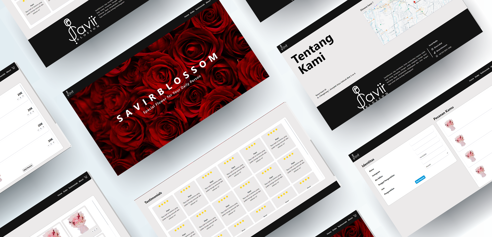

<p align="center">
  
</p>

<h1 align="center">SavirBlossom</h1>

<p align="center">
  <strong>Modern E-Commerce Frontend for a Florist Business</strong>
  <br>
  A production-ready online storefront built with Next.js 15, TypeScript, and TanStack Query — serving a real flower shop in Bandung, Indonesia.
</p>

<p align="center">
  
  
  
  
  
  
</p>

---

## About

SavirBlossom is a **production-grade e-commerce frontend** built for a real florist business. It provides a complete online shopping experience — from browsing bouquets by category to secure checkout — all through a modern, responsive interface.

The frontend communicates with a **Laravel REST API backend** via TanStack Query, featuring cookie-based JWT authentication, optimistic cart updates, and structured error handling. Built as a portfolio project, it demonstrates clean architecture, component-driven development, and real-world API integration.

---

## Features

|                                                                                                                |                                                                                                          |                                                                                                   |
| -------------------------------------------------------------------------------------------------------------- | -------------------------------------------------------------------------------------------------------- | ------------------------------------------------------------------------------------------------- |
| **🛍️ Product Catalog** — Dynamic bouquet listing with category filtering, pagination, and new-arrival badges   | **🛒 Shopping Cart** — Optimistic UI updates, quantity controls, persistent state across sessions        | **🔐 Auth System** — JWT with httpOnly cookies, login/register/password-reset, Google OAuth ready |
| **📦 Checkout Flow** — Auth-guarded checkout with shipping form validation, order summary, and API integration | **🖼️ Media Gallery** — Visual grid layout with hover animations, product showcase, and brand photography | **🎨 Modern UI** — 48+ shadcn/ui Radix primitives, custom Tailwind theme, AOS scroll animations   |
| **📱 Responsive Design** — Mobile-first layout, embla carousel for testimonials, adaptive typography system    | **🔔 Toast Notifications** — Radix-based toast system with success/error helpers at the service layer    | **⬇️ Newsletter CTA** — Prominent subscribe section with promotional banner (API-ready)           |

---

## Tech Stack

| Frontend                                          | Infrastructure                        |
| ------------------------------------------------- | ------------------------------------- |
| **Next.js 15** (App Router)                       | **TanStack Query 5** (server state)   |
| **TypeScript** (strict mode)                      | **React Hook Form** (form validation) |
| **Tailwind CSS 4** (CSS-first config)             | **Cookie-based JWT auth**             |
| **shadcn/ui** (48 Radix-based components)         | **Google OAuth** (redirect flow)      |
| **Phosphor React** + **Lucide React**             | **AOS** (scroll animations)           |
| **Class Variance Authority** (component variants) | **Embla Carousel** (touch carousel)   |

---

## Architecture

```
┌──────────────────────────────────────┐        ┌──────────────────────┐
│     Next.js App Router (SPA/SSR)     │  HTTP  │   Laravel REST API   │
│                                      │ ◄────► │   (external backend) │
│  Pages → Feature Components          │  JSON  │                      │
│    → Context Providers (Auth, Cart)  │  Auth  │   /api/auth/*        │
│      → Service Layer (React Query)   │        │   /api/bouquet/*     │
│        → API Client (fetch + cookie) │        │   /api/cart/*        │
│                                      │        │   /api/orders/*      │
└──────────────────────────────────────┘        └──────────────────────┘
```

The frontend is a **thin client** — all business logic and data persistence lives on the Laravel backend. The React Query service layer handles caching, background refetching, and optimistic mutations automatically. Auth state is shared across the app via React Context, and every API error is caught at the service layer and surfaced as a toast notification.

---

## Screenshots

<p align="center">
  
  <br>
  <em>Homepage — hero section with product categories, bouquet grid, testimonials carousel, and gallery</em>
</p>

---

## Getting Started

### Prerequisites

- Node.js 20+
- npm
- A running Laravel backend (or mock API)

### Quick Setup

```bash
# Clone the repository
git clone <repo-url>
cd savirblossom_frontend

# Configure environment
cp .env.example .env

# Install dependencies and start
npm install
npm run dev
```

<details>
<summary>Manual setup</summary>

```bash
# Install dependencies
npm install

# Environment
cp .env.example .env
# Edit .env and set NEXT_PUBLIC_API_URL to your backend URL

# Development server (opens at http://localhost:3000)
npm run dev

# Production build
npm run build
npm run start
```

</details>

---

## Environment

| Variable              | Description                         | Default                 |
| --------------------- | ----------------------------------- | ----------------------- |
| `NEXT_PUBLIC_API_URL` | Base URL of the Laravel backend API | `http://localhost:8000` |

---

## Project Structure

```
src/
├── app/                 # Next.js App Router pages
│   ├── shop/            # Product listing + detail
│   ├── cart/            # Shopping cart
│   ├── checkout/        # Checkout flow
│   ├── login/           # Authentication
│   ├── register/        # Registration
│   ├── reset-password/  # Password reset flow
│   ├── gallery/         # Media gallery
│   ├── contact-us/      # Contact page
│   └── about-us/        # About page
├── components/          # UI primitives + feature components
│   ├── ui/              # 48 shadcn/ui Radix components
│   ├── cart/            # CartItemCard, CartSummary, EmptyCart
│   └── checkout/        # CheckoutForm, OrderSummary
├── contexts/            # AuthContext, CartContext, AppProviders
├── services/            # TanStack Query hooks + API client
│   ├── auth/            # Login, register, password management
│   ├── bouquet/         # Bouquet + category CRUD
│   ├── cart/            # Cart + checkout operations
│   └── order/           # Order management
├── hooks/               # useApiError, useAuthGuard, useDebounce
├── lib/                 # Utilities, constants, toast helpers
├── types/               # TypeScript interfaces
└── assets/              # Static images
```

---

<p align="center">
  <sub>Built with Next.js, TypeScript, and Tailwind CSS — designed for SavirBlossom in Bandung, Indonesia.</sub>
</p>
